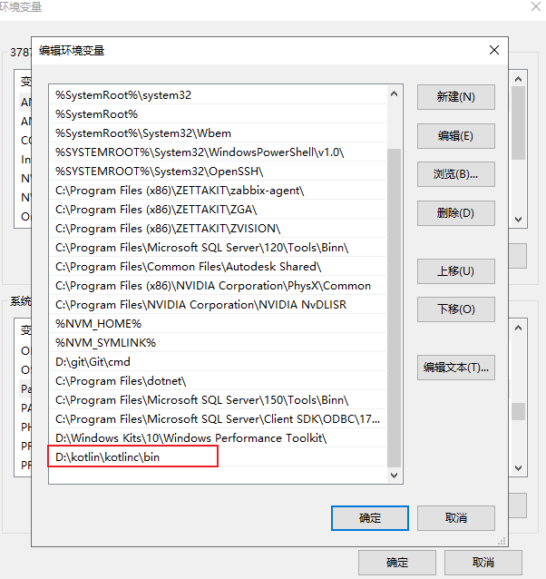
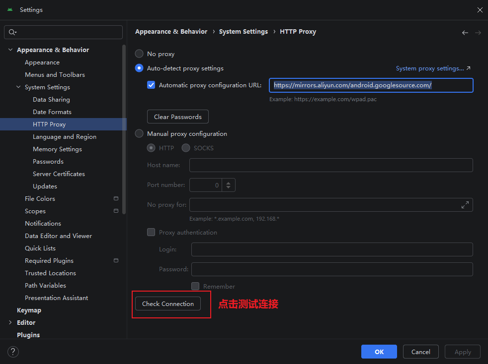
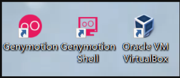
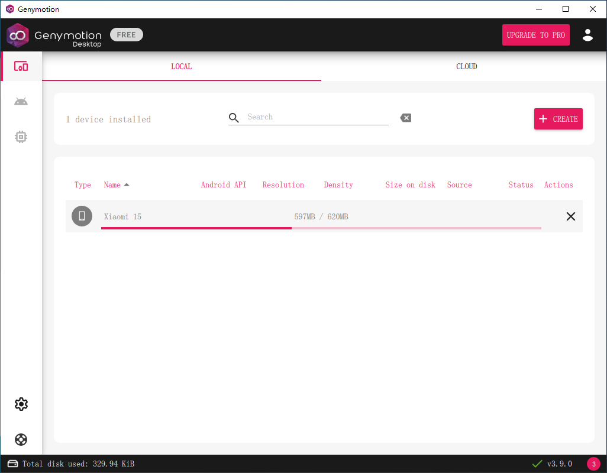
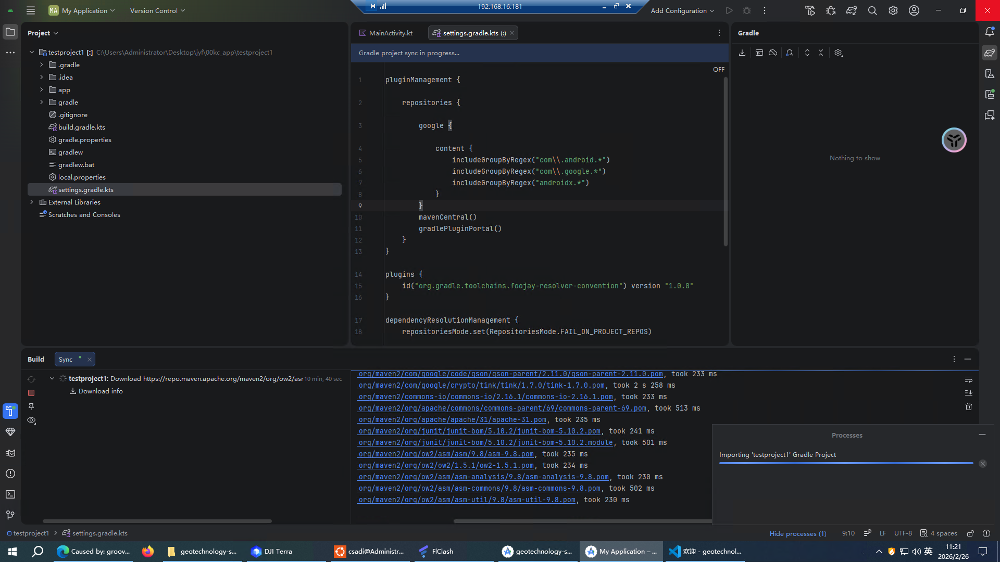
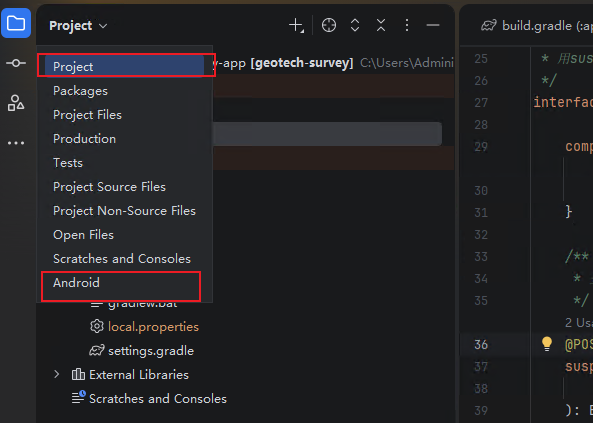
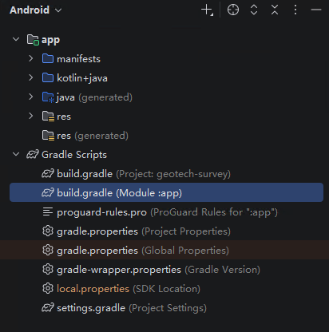
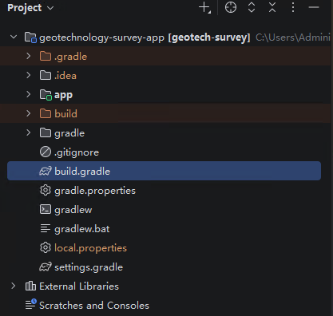
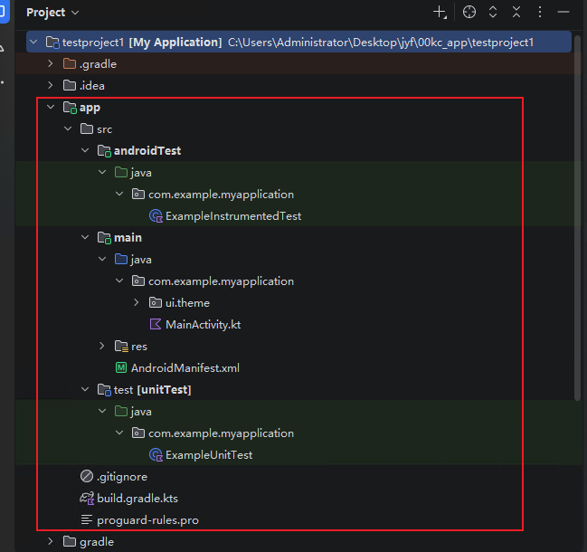
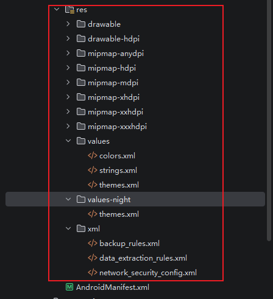

## 一、基础语法

可以参考如下笔记：

[kotlin基础语法]: https://www.itbaima.cn/zh-CN/document/urw2e6gg1lprv65w

### 1.概念及基础配置

#### (1)开发环境配置

- java环境：8、11、17（ https://www.oracle.com/java/technologies/downloads/）

- kotlin环境：
  - Windows:目前最新版2.3.10，下载.zip的压缩包即可（https://github.com/JetBrains/kotlin/releases）kotlin压缩包解压后，配置系统变量，即可在终端通过`kotlinc`命令执行.kt文件

    

  - Mac:使用homebrew安装：

    ~~~bash
    brew update
    brew install kotlin
    ~~~

#### (2)IDE

使用**Android studio**，或**IntelliJ IDEA**都可以运行kotlin程序，Android studio是基于IntelliJ IDEA开发的，可以更快速构建Android程序，所以这里下载Android studio（[下载 Android Studio 和应用工具 - Android 开发者  | Android Developers](https://developer.android.google.cn/studio?hl=zh-cn)）

- 在下载Android studio之前要提前下载好java环境

##### 1.软件安装

使用custom安装可以自定义Android SDK的安装路径

##### 2.环境变量配置

使用android studio时，android和gradle开发过程会产生各类临时文件和缓存，默认存在系统盘%userprofile%下面的.gradle、.android中，时间久了会导致系统盘容量剧增，可以通过环境变量配置将其移动至其他盘

[Android Studio2024版本安装环境SDK、Gradle配置-CSDN博客](https://blog.csdn.net/keiraee/article/details/142321644)

- gradle依赖库环境配置:

~~~bash
#新增环境变量
GRADLE_USER_HOME
D:\Androidstudio\GradleRepository
~~~

- SDK环境配置

~~~bash
#新增环境变量
ANDROID_HOME
D:\Androidstudio\SDK
#path中新增
%ANDROID_HOME%\tools
%ANDROID_HOME%\platform-tools
~~~

[环境变量  | Android Studio  | Android Developers](https://developer.android.google.cn/tools/variables?hl=zh-cn)

- 虚拟机环境配置(没成功)

剪切.android文件夹至自己的文件夹中，并进行如下配置：

~~~bash
#新增环境变量
ANDROID_AVD_HOME
D:\Androidstudio\avd
~~~

##### 3.配置代理

新建项目或打开本地项目时，会自动build项目，此时会去下载各种gradle等依赖，默认是国外的地址，需要开VPN，或者开了也很慢，配置一下国内代理

- 在系统setting中配置proxy：

~~~bash
https://mirrors.aliyun.com/android.googlesource.com/
~~~

- 在项目的gradle配置中设置镜像，打开`settings.gradle.kts`，进行如下配置：

~~~kotlin
pluginManagement {
    repositories {
        // 阿里云镜像（覆盖 Maven Central、Google、JCenter 等）
        maven { setUrl("https://maven.aliyun.com/repository/public/") }
        maven { setUrl("https://maven.aliyun.com/repository/google/") }
        maven { setUrl("https://maven.aliyun.com/repository/jcenter/") }
        maven { setUrl("https://maven.aliyun.com/repository/gradle-plugin/") }
        // 华为云镜像
        maven { setUrl("https://repo.huaweicloud.com/repository/maven/") }
        // 腾讯云镜像
        maven { setUrl("https://mirrors.cloud.tencent.com/nexus/repository/maven-public/") }
        // 网易镜像
        maven { setUrl("https://mirrors.163.com/maven/repository/maven-public/") }
        google {
            content {
                includeGroupByRegex("com\\.android.*")
                includeGroupByRegex("com\\.google.*")
                includeGroupByRegex("androidx.*")
            }
        }
        mavenCentral()
        gradlePluginPortal()
    }
}
plugins {
    id("org.gradle.toolchains.foojay-resolver-convention") version "1.0.0"
}
dependencyResolutionManagement {
    repositoriesMode.set(RepositoriesMode.FAIL_ON_PROJECT_REPOS)
    repositories {
        // 阿里云镜像（覆盖 Maven Central、Google、JCenter 等）
        maven { setUrl("https://maven.aliyun.com/repository/public/") }
        maven { setUrl("https://maven.aliyun.com/repository/google/") }
        maven { setUrl("https://maven.aliyun.com/repository/jcenter/") }
        maven { setUrl("https://maven.aliyun.com/repository/gradle-plugin/") }
        // 华为云镜像
        maven { setUrl("https://repo.huaweicloud.com/repository/maven/") }
        // 腾讯云镜像
        maven { setUrl("https://mirrors.cloud.tencent.com/nexus/repository/maven-public/") }
        // 网易镜像
        maven { setUrl("https://mirrors.163.com/maven/repository/maven-public/") }
        google()
        mavenCentral()
    }
}

rootProject.name = "My Application"
include(":app")
~~~

##### 4.Genymotion虚拟机

对于CPU为AMD的电脑，无法使用Android studio自带的虚拟机，此时可以使用Genymotion

[超详细！解答Android Studio创建虚拟机时出现的Your CPU does not support required features (VT-x or SVM).-CSDN博客](https://blog.csdn.net/weixin_45464418/article/details/113116577)

- 下载Genymotion：下载该软件时会下载*VirtualBox*，安装时只能安装在默认路径，下载完成后，会新增三个图标

- 创建并下载虚拟机设备（可以在软件设置中设置虚拟机设备存储位置）

- 在Android studio中安装插件

#### (3)Android应用特色

##### 1.**四大组件**

Android系统四大组件分别是Activity、Service、BroadcastReceiver和ContentProvider。

- Activity：所有Android应用程序的门面，凡是在应用中你看得到的东西，都是放在Activity中的。
- Service：在后台默默地运行，即使用户退出了应用，Service仍然是可以继续运行的。
- BroadcastReceiver：允许你的应用接收来自各处的广播消息，比如电话、短信等，当然，你的应用也可以向外发出广播消息。
- ContentProvider：为应用程序之间共享数据提供了可能，比如你想要读取系统通讯录中的联系人，就需要通过ContentProvider来实现。

##### 2.**丰富的系统控件**

Android系统为开发者提供了丰富的系统控件，使得我们可以很轻松地编写出漂亮的界面。当然如果你品位比较高，不满足于系统自带的控件效果，完全可以定制属于自己的控件。

##### 3.**SQLite数据库**

Android系统还自带了这种轻量级、运算速度极快的嵌入式关系型数据库。它不仅支持标准的SQL语法，还可以通过Android封装好的API进行操作，让存储和读取数据变得非常方便。

##### 4.**强大的多媒体**

Android系统还提供了丰富的多媒体服务，如音乐、视频、录音、拍照等，这一切你都可以在程序中通过代码进行控制，让你的应用变得更加丰富多彩。

#### (4)新建项目

##### 1.创建项目

新建项目后，会自动开始build，并下载build所需要的资源（如gradle），此时如果网速过慢，可以停止build，在`settings.gradle`中配置镜像后再开始build

build完成后，可以直接运行程序

##### 2.项目结构分析

在Android studio中项目目录有多种查看方式，可以通过左上角的下拉项进行切换，常用的有Android模式和project模式

- Android模式：被Android Studio转换过的目录结构，结构简洁明了，适合进行快速开发

- project模式：项目真实的目录结构

以下详细介绍project模式下的真实文件结构

①**.gradle和.idea**

这两个目录下放置的都是Android Studio自动生成的一些文件，无须关心，也不要去手动编辑。

②**app**

项目中的代码、资源等内容都是放置在这个目录下的，我们后面的开发工作也基本是在这个目录下进行的

③**build**

主要包含了一些在编译时自动生成的文件

④**gradle**

这个目录下包含了gradle wrapper的配置文件，使用gradle wrapper的方式不需要提前将gradle下载好，而是会自动根据本地的缓存情况决定是否需要联网下载gradle。Android Studio默认就是启用gradle wrapper方式的，如果需要更改成离线模式，可以点击Android Studio导航栏→File→Settings→Build, Execution, Deployment→Gradle，进行配置更改。

⑤**.gitignore**

git版本控制

⑥**build.gradle**

项目全局的gradle构建脚本，通常这个文件中的内容是不需要修改的。

⑦**gradle.properties**

这个文件是全局的gradle配置文件，在这里配置的属性将会影响到项目中所有的gradle编译脚本。

⑧**gradlew和gradlew.bat**

这两个文件是用来在命令行界面中执行gradle命令的，其中gradlew是在Linux或Mac系统中使用的，gradlew.bat是在Windows系统中使用的。

⑨**local.properties**

这个文件用于指定本机中的Android SDK路径，通常内容是自动生成的，我们并不需要修改。除非你本机中的Android SDK位置发生了变化，那么就将这个文件中的路径改成新的位置即可。

⑩**settings.gradle**

这个文件用于指定项目中所有引入的模块。由于HelloWorld项目中只有一个app模块，因此该文件中也就只引入了app这一个模块。通常情况下，模块的引入是自动完成的，需要我们手动修改这个文件的场景可能比较少。

##### 3.**app目录结构**

①**build**

这个目录和外层的build目录类似，也包含了一些在编译时自动生成的文件，不过它里面的内容会更加复杂，我们不需要过多关心。

②**libs**

如果项目中使用到了第三方jar包，就需要把这些jar包都放在libs目录下，放在这个目录下的jar包会被自动添加到项目的构建路径里。

③**androidTest**

此处是用来编写Android Test测试用例的，可以对项目进行一些自动化测试。

④**java**

java目录是放置我们所有Java代码的地方（Kotlin代码也放在这里），展开该目录，你将看到系统帮我们自动生成了一个MainActivity文件。

⑤**res**

项目中使用到的所有图片、布局、字符串等资源都要存放在这个目录下。这个目录下还有很多子目录，图片放在drawable目录下，布局放在layout目录下，字符串放在values目录下，所以你不用担心会把整个res目录弄得乱糟糟的。

⑥**AndroidManifest.xml**

这是整个Android项目的配置文件，你在程序中定义的所有四大组件都需要在这个文件里注册，另外还可以在这个文件中给应用程序添加权限声明。由于这个文件以后会经常用到，我们等用到的时候再做详细说明。

⑦**test**

此处是用来编写Unit Test测试用例的，是对项目进行自动化测试的另一种方式。

⑧**.gitignore**

这个文件用于将app模块内指定的目录或文件排除在版本控制之外，作用和外层的.gitignore文件类似。

⑨**build.gradle**

这是app模块的gradle构建脚本，这个文件中会指定很多项目构建相关的配置，我们稍后将会详细分析gradle构建脚本中的具体内容。

⑩**proguard-rules.pro**

这个文件用于指定项目代码的混淆规则，当代码开发完成后打包成安装包文件，如果不希望代码被别人破解，通常会将代码进行混淆，从而让破解者难以阅读。

##### 4.项目执行过程

**①Android- Manifest.xml**

在Android- Manifest.xml文件，从中可以找到如下代码：

~~~xml
<activity
            android:name=".MainActivity"
            android:exported="true"
            android:label="@string/app_name">
            <intent-filter>
                <action android:name="android.intent.action.MAIN" />
                <category android:name="android.intent.category.LAUNCHER" />
            </intent-filter>
</activity>
~~~

- 这段代码表示对MainActivity进行注册，没有在AndroidManifest.xml里注册的Activity是不能使用的。
- 其中`intent-filter`里的两行代码非常重要，`<action android:name="android.intent.action.MAIN"/>` 和`<category android:name="android.intent.category.LAUNCHER" />`表示MainActivity是这个项目的主Activity，在手机上点击应用图标，首先启动的就是这个Activity。

**②MainActivity.kt**

~~~kotlin
class MainActivity : ComponentActivity() {
    override fun onCreate(savedInstanceState: Bundle?) {
        super.onCreate(savedInstanceState)
        enableEdgeToEdge()
        setContent {
            MyApplicationTheme {
                Scaffold(modifier = Modifier.fillMaxSize()) { innerPadding ->
                    Greeting(
                        name = "Android",
                        modifier = Modifier.padding(innerPadding)
                    )
                }
            }
        }
    }
}
~~~

- 首先可以看到，MainActivity是继承自`CompatActivity`的。
- `CompatActivity`是AndroidX中提供的一种向下兼容的Activity，可以使Activity在不同系统版本中的功能保持一致性。而Activity类是Android系统提供的一个基类，我们项目中所有自定义的Activity都必须继承它或者它的子类才能拥有Activity的特性（`CompatActivity`是Activity的子类）
- 然后可以看到MainActivity中有一个`onCreate()`方法，这个方法是一个Activity被创建时必定要执行的方法

##### 5.**res目录结构**

- 所有以“drawable”开头的目录都是用来放图片的
- 所有以“mipmap”开头的目录都是用来放应用图标的
- 所有以“values”开头的目录都是用来放字符串、样式、颜色等配置的
- 所有以“layout”开头的目录都是用来放布局文件的

之所以有这么多“mipmap”开头的目录，其实主要是为了让程序能够更好地兼容各种设备。drawable目录也是相同的道理，在制作程序的时候，最好能够给同一张图片提供几个不同分辨率的版本，分别放在这些目录下，然后程序运行的时候，会自动根据当前运行设备分辨率的高低选择加载哪个目录下的图片。更多的时候美工只会提供给我们一份图片，这时你把所有图片都放在drawable-xxhdpi目录下就好了，因为这是最主流的设备分辨率目录。

**如何引用res中的资源（以`res/values/strings.xml`文件为例）：**

~~~xml
<resources>
    <string name="app_name">Feibaos APP</string>
</resources>
~~~

- 在代码中通过`R.string.app_name`可以获得该字符串的引用。
- 在XML中通过`@string/app_name`可以获得该字符串的引用。

##### 6.详解build.gradle文件

Gradle是一个非常先进的项目构建工具，它使用了一种基于Groovy的领域特定语言（DSL）来进行项目设置，摒弃了传统基于XML（如Ant和Maven）的各种烦琐配置。项目中有两个build.gradle文件，一个是在最外层目录下的，一个是在app目录下的。

①项目build.gradle

~~~kotlin
buildscript {
    buildscript {
        ext {
            config = "${rootDir}/config.gradle"
            api_config = "${rootDir}/api_config.gradle"
            compose_version = '1.1.1'
            hilt_version = '2.44'
            accompanistVersion = "0.24.2-alpha"
            camerax_version = "1.2.2"
            pagingVersion = "3.1.0-rc01"
            pagingComposeVersion = "1.0.0-alpha14"
            datastoreVersion = "1.0.0-rc02"
        }
        dependencies {
            classpath "com.google.dagger:hilt-android-gradle-plugin:$hilt_version"
        }
    }
}// Top-level build file where you can add configuration options common to all sub-projects/modules.
plugins {
    id 'com.android.application' version '7.1.2' apply false
    id 'com.android.library' version '7.1.2' apply false
    id 'org.jetbrains.kotlin.android' version '1.6.10' apply false
}

task clean(type: Delete) {
    delete rootProject.buildDir
}
~~~

通常情况下，你并不需要修改这个文件中的内容，除非你想添加一些全局的项目构建配置。

②app目录build.gradle

~~~kotlin
plugins {
    id 'com.android.application'
    id 'org.jetbrains.kotlin.android'
    id 'kotlin-kapt'
    id 'dagger.hilt.android.plugin'
    id "kotlin-parcelize"
}

android {
    namespace 'com.geoscene.survey.app'
    compileSdk 34

    defaultConfig {
        applicationId "com.geoscene.survey.app"
        minSdk 31
        targetSdk 34
        versionCode 1
        versionName "1.0"

        testInstrumentationRunner "androidx.test.runner.AndroidJUnitRunner"
        javaCompileOptions {
            annotationProcessorOptions {
                arguments += [AROUTER_MODULE_NAME: project.getName()]
            }
        }
        // 检查是否有 API_KEY 属性，如果没有则给个默认空字符串
        def apiKey = project.hasProperty('API_KEY') ? API_KEY : ""
        buildConfigField("String", "API_KEY", "\"$apiKey\"")
    }

    buildTypes {
        release {
            minifyEnabled false
            proguardFiles getDefaultProguardFile('proguard-android-optimize.txt'), 'proguard-rules.pro'
        }
    }
    compileOptions {
        sourceCompatibility JavaVersion.VERSION_1_8
        targetCompatibility JavaVersion.VERSION_1_8
    }
    buildFeatures {
        compose true
        viewBinding true
        buildConfig true
    }

    kotlinOptions {
        jvmTarget = '1.8'
    }
    composeOptions {
        kotlinCompilerExtensionVersion compose_version
    }

    packagingOptions {
        exclude 'META-INF/DEPENDENCIES'
    }
}

dependencies {

    implementation 'androidx.core:core-ktx:1.7.0'
    // 基础UI框架
    implementation "androidx.compose.ui:ui:$compose_version"
    // Material风格布局
    implementation "androidx.compose.material:material:$compose_version"
    implementation "androidx.compose.ui:ui-tooling-preview:$compose_version"
    implementation 'androidx.lifecycle:lifecycle-runtime-ktx:2.4.1'
//    implementation 'androidx.activity:activity-compose:1.4.0'
    implementation 'androidx.room:room-ktx:2.4.2'
    // Compose扩展Activity
    implementation 'androidx.activity:activity-compose:1.6.1'
    implementation 'androidx.activity:activity-ktx:1.6.1'

    //compose Accompanist组件
    implementation "com.google.accompanist:accompanist-pager:$accompanistVersion"
    implementation "com.google.accompanist:accompanist-pager-indicators:$accompanistVersion"
    implementation "com.google.accompanist:accompanist-insets:$accompanistVersion"
    implementation "com.google.accompanist:accompanist-coil:0.15.0"
    implementation "com.google.accompanist:accompanist-systemuicontroller:$accompanistVersion"
    implementation "com.google.accompanist:accompanist-glide:0.15.0"
    implementation "com.google.accompanist:accompanist-swiperefresh:$accompanistVersion"
    implementation "com.google.accompanist:accompanist-flowlayout:$accompanistVersion"
    implementation "com.google.accompanist:accompanist-placeholder-material:$accompanistVersion"
    implementation "com.google.accompanist:accompanist-permissions:$accompanistVersion"

    testImplementation 'junit:junit:4.13.2'
    androidTestImplementation 'androidx.test.ext:junit:1.1.3'
    androidTestImplementation 'androidx.test.espresso:espresso-core:3.4.0'
    // UI测试
    androidTestImplementation "androidx.compose.ui:ui-test-junit4:$compose_version"
    // UI工具包
    debugImplementation "androidx.compose.ui:ui-tooling:$compose_version"

    implementation("androidx.constraintlayout:constraintlayout:2.1.3")
    implementation("androidx.constraintlayout:constraintlayout-compose:1.0.0")

    //Navigation
    implementation "androidx.navigation:navigation-compose:2.5.3"

    //Hilt
    implementation "com.google.dagger:hilt-android:$hilt_version"
    kapt "com.google.dagger:hilt-android-compiler:$hilt_version"
//    implementation "androidx.hilt:hilt-lifecycle-viewmodel:1.0.0-alpha03"
    implementation "androidx.hilt:hilt-navigation-compose:1.0.0"
//    kapt 'androidx.hilt:hilt-compiler:1.0.0'

    //camerax
    // The following line is optional, as the core library is included indirectly by camera-camera2
    implementation "androidx.camera:camera-core:$camerax_version"
    implementation "androidx.camera:camera-camera2:$camerax_version"
    // If you want to additionally use the CameraX Lifecycle library
    implementation "androidx.camera:camera-lifecycle:$camerax_version"
    // If you want to additionally use the CameraX View class
    implementation "androidx.camera:camera-view:$camerax_version"
    implementation 'com.google.mlkit:barcode-scanning:17.0.3'

    //paging分页库
    implementation "androidx.paging:paging-runtime:$pagingVersion"
    testImplementation "androidx.paging:paging-common:$pagingVersion"
    implementation "androidx.paging:paging-compose:$pagingComposeVersion"

    //arcgis api
    implementation 'com.esri:arcgis-maps-kotlin:200.2.0'

    //retrofit请求
    implementation 'com.google.code.gson:gson:2.8.5'
    implementation 'com.squareup.retrofit2:retrofit:2.9.0'
    implementation 'com.squareup.retrofit2:converter-gson:2.9.0'

    //数据保存，用于cookie持久化
    implementation "androidx.datastore:datastore-preferences:$datastoreVersion"
    implementation "androidx.datastore:datastore-core:$datastoreVersion"

    //二维码
    implementation "com.google.zxing:core:3.3.0"

    //chart
    implementation 'com.github.PhilJay:MPAndroidChart:v3.1.0'

    //图片加载coil
    implementation 'io.coil-kt:coil-compose:2.2.2'

    //datetime picker
    implementation 'com.github.commandiron:WheelPickerCompose:1.1.11'

}
~~~

- 第一行应用了一个插件，一般有两种值可选：`com.android.application`表示这是一个应用程序模块，`com.android.library`表示这是一个库模块。
- 紧接着是一个大的`android`闭包，在这个闭包中我们可以配置项目构建的各种属性。
  - `compileSdkVersion`用于指定项目的编译版本
  - `defaultConfig`闭包中可以对项目的更多细节进行配置:
    - `applicationId`是每一个应用的唯一标识符，绝对不能重复，默认会使用我们在创建项目时指定的包名
    - `minSdkVersion`用于指定项目最低兼容的Android系统版本
    - `targetSdkVersion`指定的值表示你在该目标版本上已经做过了充分的测试，系统将会为你的应用程序启用一些最新的功能和特性
    - `versionCode`用于指定项目的版本号
    - `versionName`用于指定项目的版本名
    - `testInstrumentationRunner`用于在当前项目中启用JUnit测试，你可以为当前项目编写测试用例，以保证功能的正确性和稳定性。
  - `buildTypes`闭包中用于指定生成安装文件的相关配置:
    - `debug`闭包用于指定生成测试版安装文件的配置，可以忽略不写
    - `elease`闭包用于指定生成正式版安装文件的配置：`minifyEnabled`用于指定是否对项目的代码进行混淆，`proguardFiles`用于指定混淆时使用的规则文件
  - `dependencies`闭包可以指定当前项目所有的依赖关系，通常Android Studio项目一共有3种依赖方式：本地依赖、库依赖和远程依赖：
    - 本地依赖可以对本地的jar包或目录添加依赖关系，`implementation fileTree`就是一个本地依赖声明，它表示将libs目录下所有.jar后缀的文件都添加到项目的构建路径中。
    - `implementation`则是远程依赖声明，远程依赖则可以对jcenter仓库上的开源项目添加依赖关系。加上这句声明后，Gradle在构建项目时会首先检查一下本地是否已经有这个库的缓存，如果没有的话则会自动联网下载，然后再添加到项目的构建路径中。
    - 库依赖可以对项目中的库模块添加依赖关系，它的基本格式是`implementation project`后面加上要依赖的库的名称
    - `testImplementation`和`androidTestImplementation`都是用于声明测试用例库的，这个我们暂时用不到，先忽略它就可以了。

#### (5)日志工具的使用

