## CSADI API 资源池使用指南（内部试行版）

### 一、门户网站基本使用

#### 1.api资源池的基本概念

CSADI API 资源池是基于开源项目 **New API** 搭建的内部中转与管理平台。

- **定位**：它是连接“下游用户”与“上游大模型供应商”的智能桥梁，目的是实现部门员工api资源的统一调度。
- **核心优点**：
  - **资源聚合**：一个接口通达全球主流模型，无需反复切换账号。
  - **稳定性极高**：集成多个渠道，当某个线路不稳定时，系统会自动秒级切换，保证业务不中断。
  - **成本透明**：实时查看个人 Token 消耗，部门可根据需求精准分配额度。
  - **灵活扩展**：我们已针对前端代码进行自定义修改，未来将上线更多符合部门业务的功能。
- **管理提示**：请妥善保管个人账号及生成的令牌，避免额度被他人冒用。

#### 2.登录访问门户网站

- **访问地址**：http://192.168.4.57:3000/login （建议收藏至浏览器书签）
- **登录账号**：
  - **账号**：员工真实姓名（如：张三）
  - **初始密码**：`csadi123456`
  - *注：首次登录后，请务必前往“个人设置”修改初始密码。*

- 模块功能速览：

1. **数据看板**：个人“仪表盘”，实时显示当前账户余额、历史消耗趋势及站内重要通知。
2. **令牌管理**：在这里生成用于连接 claude、代码或第三方工具的“钥匙”。
3. **使用日志**：记录每一笔 API 调用的时间、模型、消耗 Token 及产生的费用。
4. **钱包管理**：用于额度充值，查看账户的总资产状况。
5. **个人设置**：修改个人信息、重置登录密码及查看个人专属 ID。

#### 3.创建个人令牌

要在软件或代码中使用 AI，必须先生成一个令牌：

1. 点击左侧导航栏 **“令牌管理”**，点击 **“添加新的令牌”**。
2. **参数配置**：
   - **名称**：建议命名为用途（如：`Chatbox使用` 或 `项目A测试`）。
   - **令牌分组**：选**auto**分组，与token消耗计费有关
   - **过期时间**：建议选“永不过期”。
   - **额度设置**：默认“无限额度”是指该令牌可以使用您账户下的所有余额。若要控制某个工具的消耗，可手动设置额度。
3. 点击提交后，在列表点击 **“复制”**。您将得到一个以 `sk-` 开头的字符串，这就是您的个人专用 API Key。

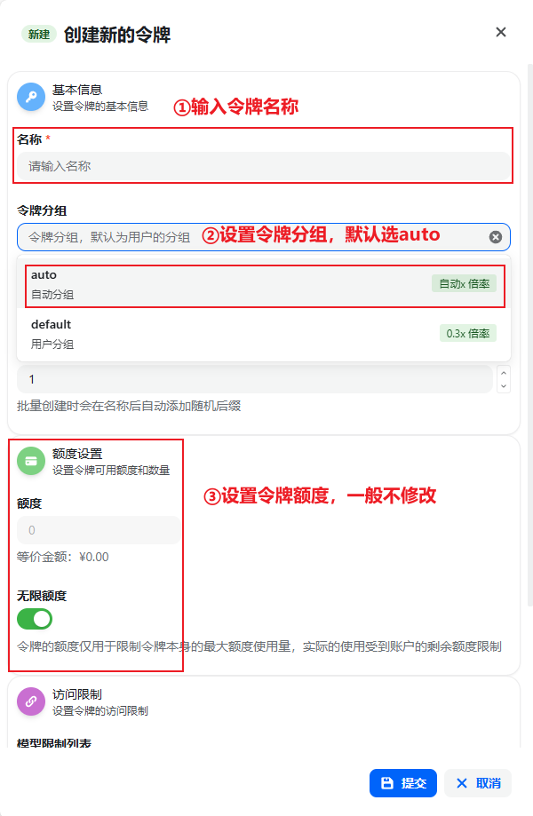

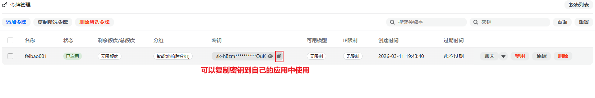

#### 4.额度充值

(1)额度下发机制

出于部门财务管理规范，API 资源池不开放个人直接购买。

- **按月下发**：管理员会定期根据项目需求，向员工发放“兑换码”。
- **申请增额**：若当月基础额度耗尽，请向部门管理员（[管理员姓名]）提交简要申请，获批后将发放额外兑换码。

(2)额度充值操作

1. 进入 **“钱包管理”** 模块。
2. 找到 **“兑换码充值”** 区域。
3. 输入管理员发放的字符代码，点击 **“兑换”**。
4. 充值成功后，额度将立即更新，您可以在看板中查看。

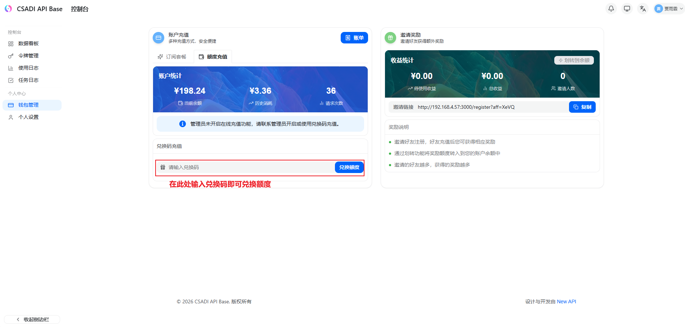

#### 5.API调用

在常用的AI工具中 (如 claude code cli 、codex)中自定义服务基地址和apikey，目前系统只集成了claude模型和codex模型，后续会继续添加

- API 域名（base_url）：
  - claude：http://192.168.4.57:3000
  - codex：http://192.168.4.57:3000/v1
- apikey：在门户中申请的令牌（一般以sk开头）

如果你的电脑已经安装过claude或codex，可以参考以下方式进行修改（没有安装过参考`二、cli工具安装教程进行安装`）：

##### (1)claude配置修改

对于Windows电脑，会在用户根目录(例如`C:\Users\3787(你自己的用户名)`)下有一个`.claude`文件夹，进入文件夹，打开`settings.json`文件，即可修改baseURL和apikey

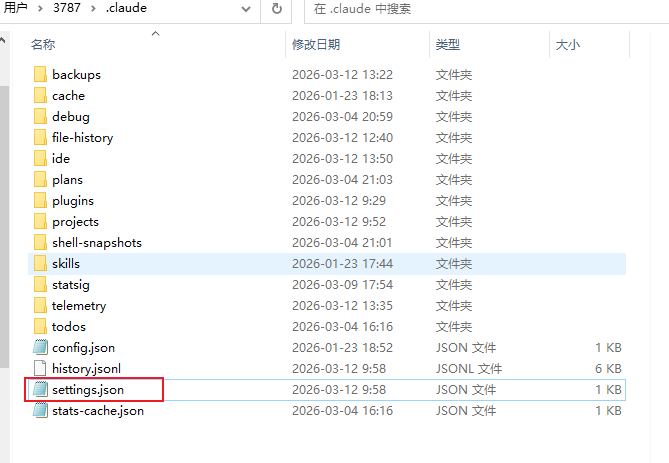

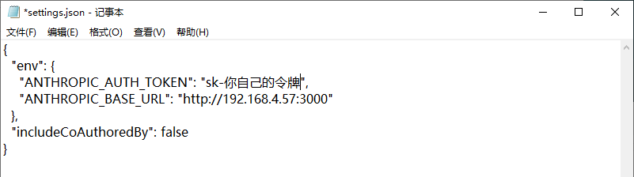

##### (2)codex配置修改

对于Windows电脑，会在用户根目录(例如`C:\Users\3787(你自己的用户名)`)下有一个`.codex`文件夹，进入文件夹，在`config.toml`文件中修改baseURL，在`auth.json`文件中修改令牌

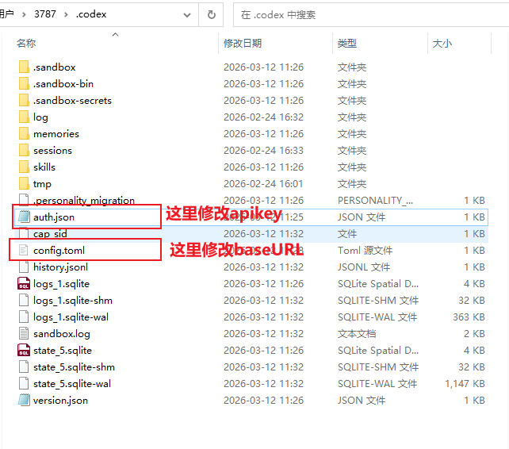

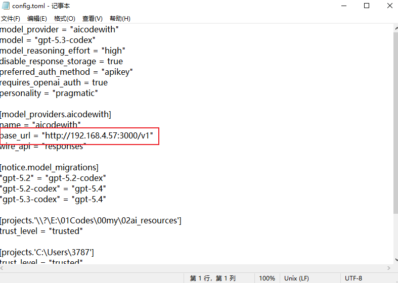

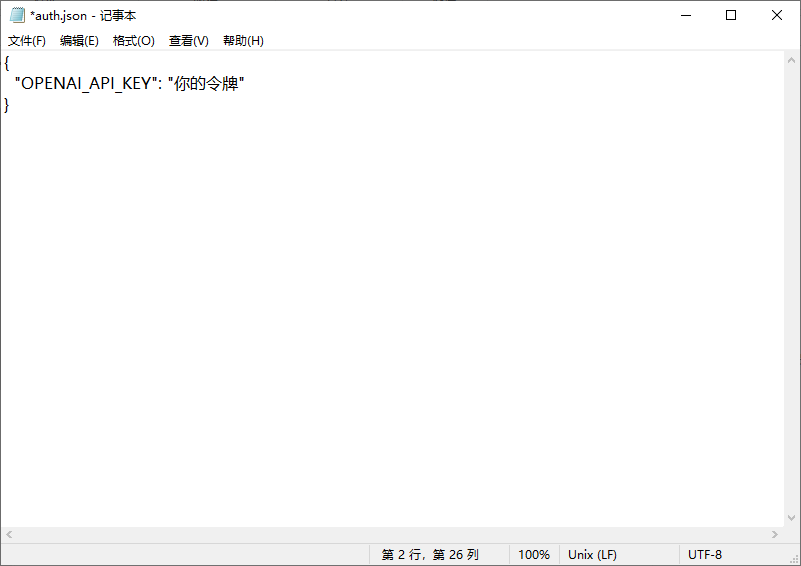

### 二、cli工具安装

#### 1.claude code安装

##### (1)下载安装

推荐两种方式：powershell安装和node安装

**①node安装**

如果你的电脑上有node.js并且版本在18及以上，那么你就可以使用此方法安装：

- 验证node安装

~~~bash
node --version
~~~

如果出现下面的提示就说明 node 已经安装成功了

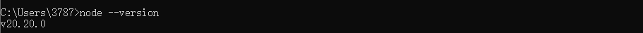

- 安装 Claude Code CLI

~~~bash
npm install -g @anthropic-ai/claude-code --registry=https://registry.npmmirror.com/
~~~

[^注意]: 如果遇到在此系统上禁止运行脚本，需要用管理员权限运行powershell，然后执行 `Set-ExecutionPolicy Unrestricted` 命令

**②powershell安装**

打开 **PowerShell**（建议以管理员身份运行）并执行

~~~bash
irm https://claude.ai/install.ps1 | iex
~~~

安装完成以后，在终端输入以下命令进行验证：

~~~bash
claude -version
~~~

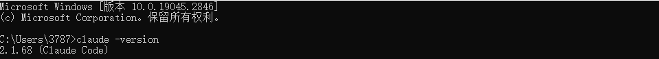

如果显示版本号，说明安装成功!

##### (2)创建配置文件

打开 **PowerShell**（建议以管理员身份运行）并执行（**注意替换apikey！！！**）：

~~~bash
# 目标目录：C:\Users\<you>\.claude
$dir = Join-Path $env:USERPROFILE ".claude"
$settingsFile = Join-Path $dir "settings.json"
$claudeJsonFile = Join-Path $env:USERPROFILE ".claude.json"

# 创建目录（存在不报错）
New-Item -ItemType Directory -Path $dir -Force | Out-Null

# 1. 写入 settings.json（API 配置）
$settingsJson = @'
{
  "env": {
    "ANTHROPIC_AUTH_TOKEN": "！！！这里修改成你的令牌！！！",
    "ANTHROPIC_BASE_URL": "http://192.168.4.57:3000"
  }
}
'@
[System.IO.File]::WriteAllText($settingsFile, $settingsJson, (New-Object System.Text.UTF8Encoding($false)))

# 2. 写入 .claude.json（跳过登录）- 注意这个文件在用户根目录
$claudeJson = @'
{
  "hasCompletedOnboarding": true
}
'@
[System.IO.File]::WriteAllText($claudeJsonFile, $claudeJson, (New-Object System.Text.UTF8Encoding($false)))

Write-Host "配置完成！"
Write-Host "  - settings.json: $settingsFile"
Write-Host "  - .claude.json: $claudeJsonFile"
~~~

##### (3)验证安装

重新打开 PowerShell 或者 IDE，运行：

~~~bash
claude
~~~

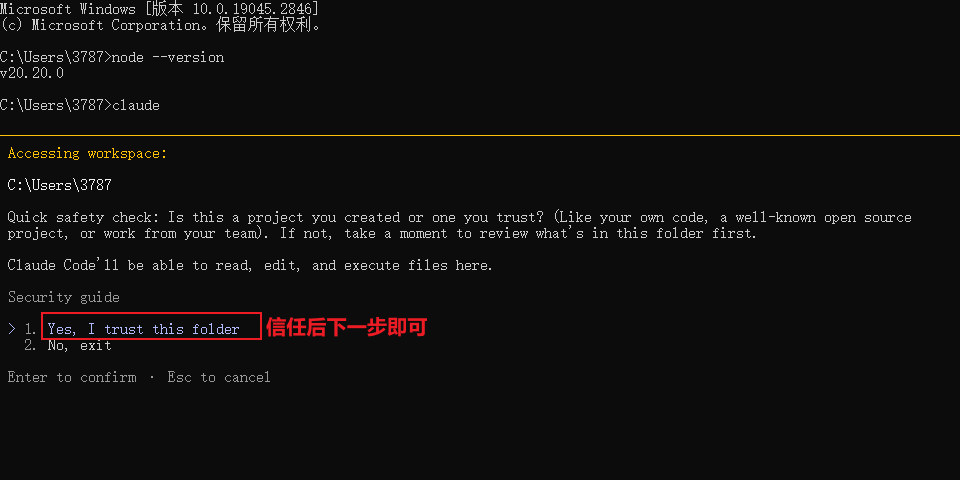

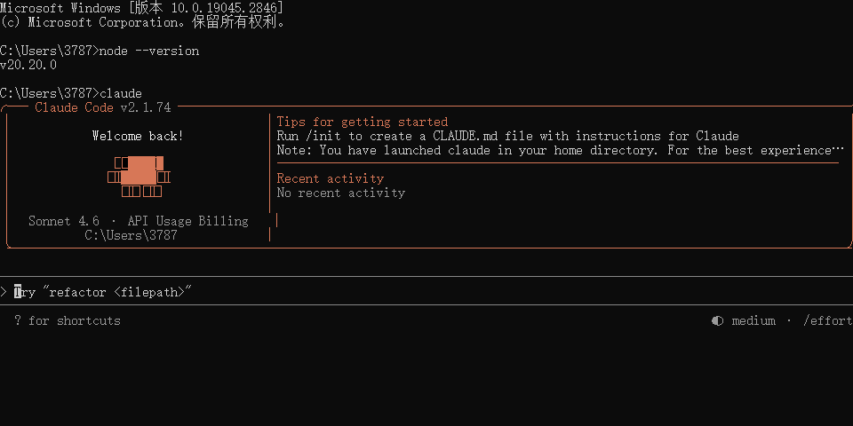

接下来就可以愉快的使用claude啦！！！

#### 2.codex安装

##### (1)下载安装

codeX需要node版本在20及以上，如果没有node，可以去官网下载一个（如果你要做前端开发，推荐使用nvm进行node版本管理）

- 验证node安装（注意版本要在20及以上）

~~~bash
node --version
~~~

如果出现下面的提示就说明 node 已经安装成功了

没有node访问 https://nodejs.org/ 进行下载

- 安装CodeX CLI

~~~bash
npm install -g @openai/codex --registry=https://registry.npmmirror.com/
~~~

[^注意]: 如果遇到在此系统上禁止运行脚本，需要用管理员权限运行powershell，然后执行 `Set-ExecutionPolicy Unrestricted` 命令

##### (2)创建配置文件

打开 **PowerShell**（建议以管理员身份运行）并执行（**注意替换apikey！！！**）：

~~~bash
# 目标目录
$dir = Join-Path $env:USERPROFILE ".codex"

# 创建目录（存在不报错）
New-Item -ItemType Directory -Path $dir -Force | Out-Null

# 写 auth.json（UTF-8 无 BOM，覆盖）
$auth = @'
{
  "OPENAI_API_KEY": "！！！这里修改成你的令牌！！！"
}
'@
[System.IO.File]::WriteAllText(
  (Join-Path $dir "auth.json"),
  $auth,
  (New-Object System.Text.UTF8Encoding($false))
)

# 写 config.toml（UTF-8 无 BOM，覆盖）
$config = @'
model_provider = "aicodewith"
model = "gpt-5.3-codex"
model_reasoning_effort = "high"
disable_response_storage = true
preferred_auth_method = "apikey"
requires_openai_auth = true

enableRouteSelection = true

[model_providers.aicodewith]
name = "aicodewith"
base_url = "http://192.168.4.57:3000/v1"
wire_api = "responses"
'@
[System.IO.File]::WriteAllText(
  (Join-Path $dir "config.toml"),
  $config,
  (New-Object System.Text.UTF8Encoding($false))
)

~~~

验证是否设置成功：

~~~bash
Get-Content "$env:USERPROFILE\.codex\auth.json"
Get-Content "$env:USERPROFILE\.codex\config.toml"
~~~

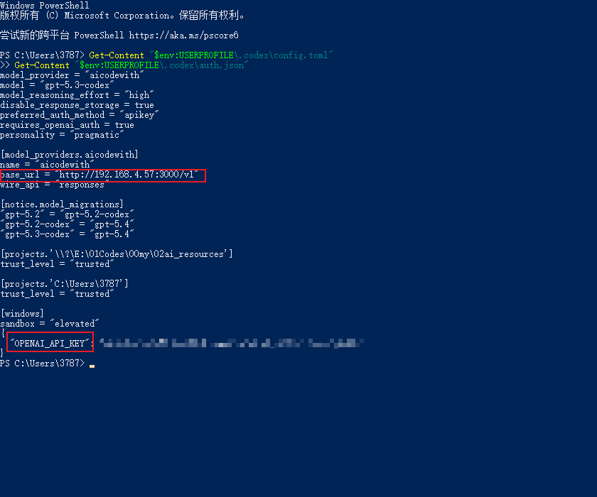

##### (3)验证安装

powershell 中输入 codex 启动

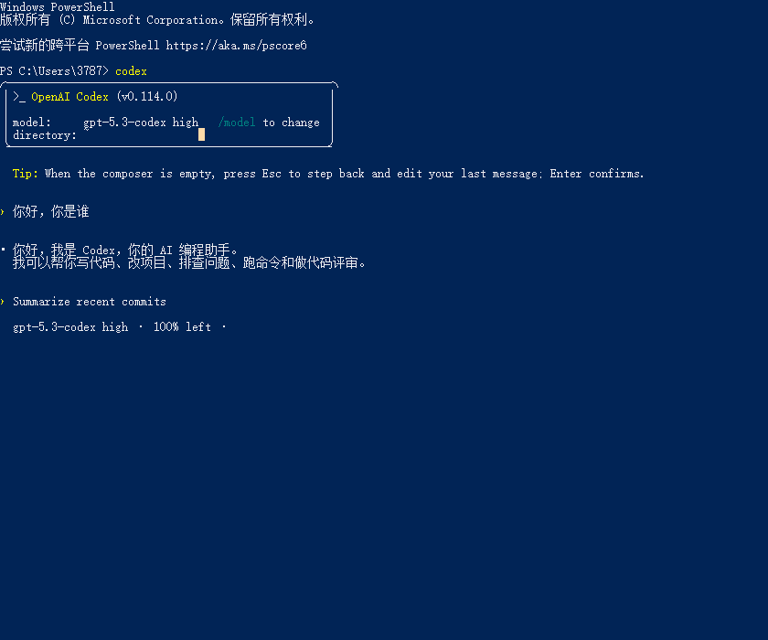

然后在对话框中，输入：您好！，跟他打个招呼，如果正常回复，并且在平台内看到调用记录，则安装成功

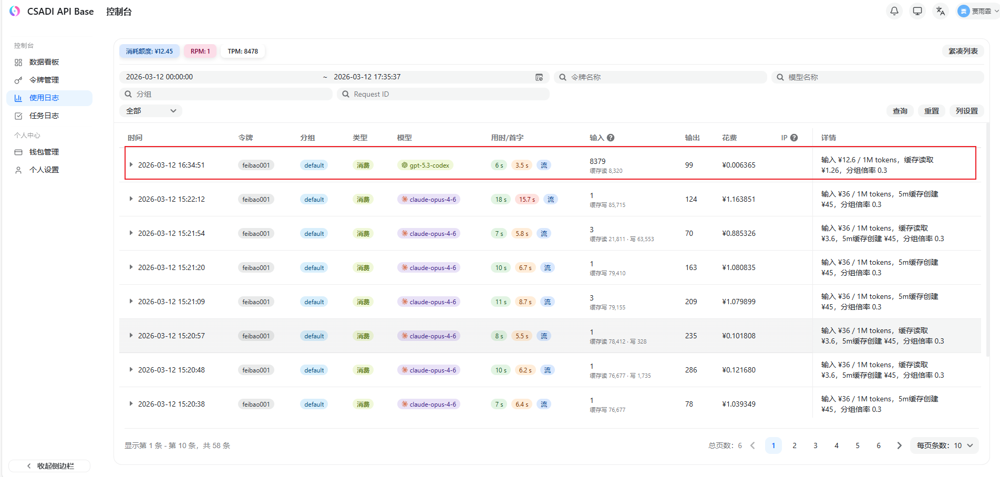

