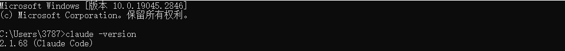
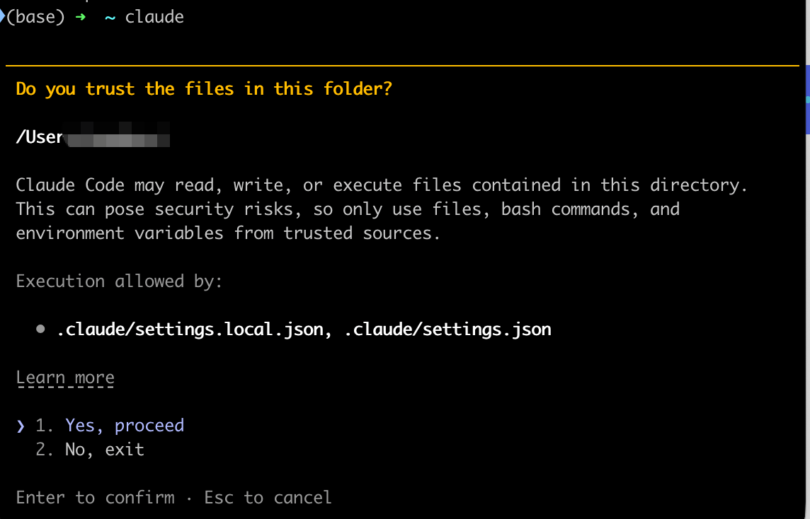
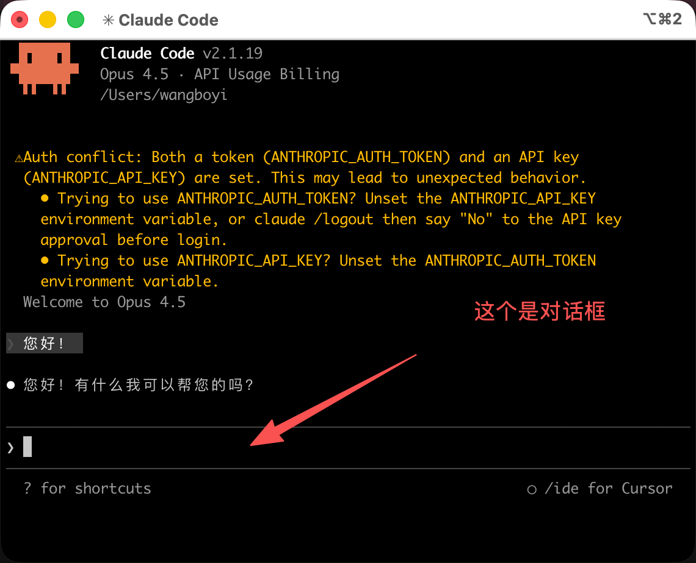
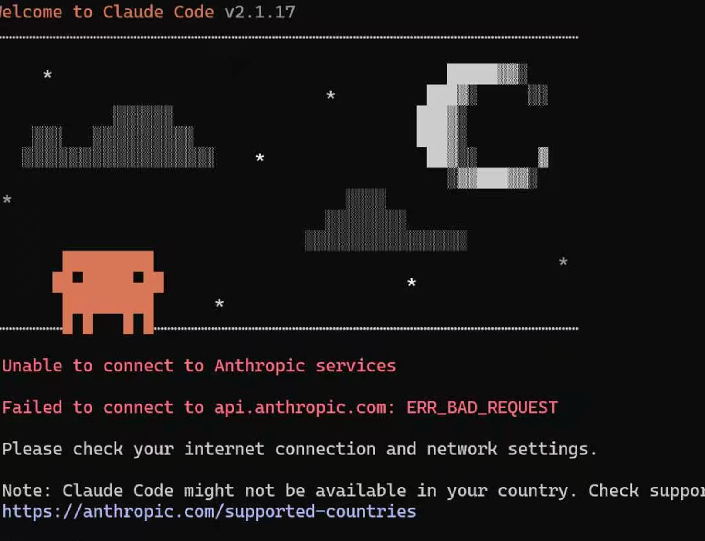
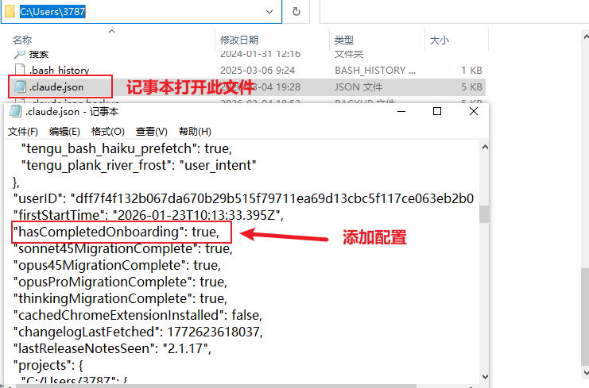
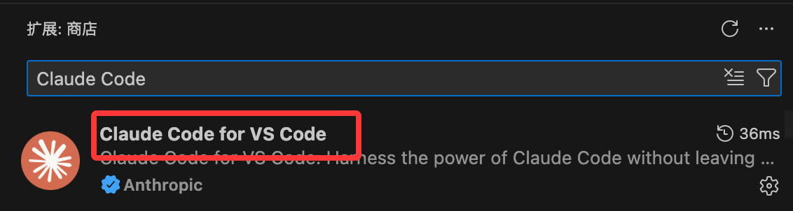
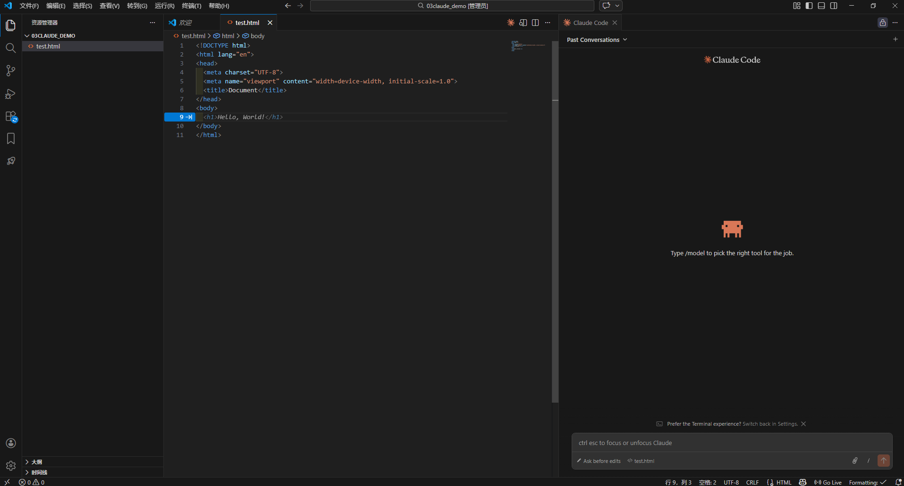
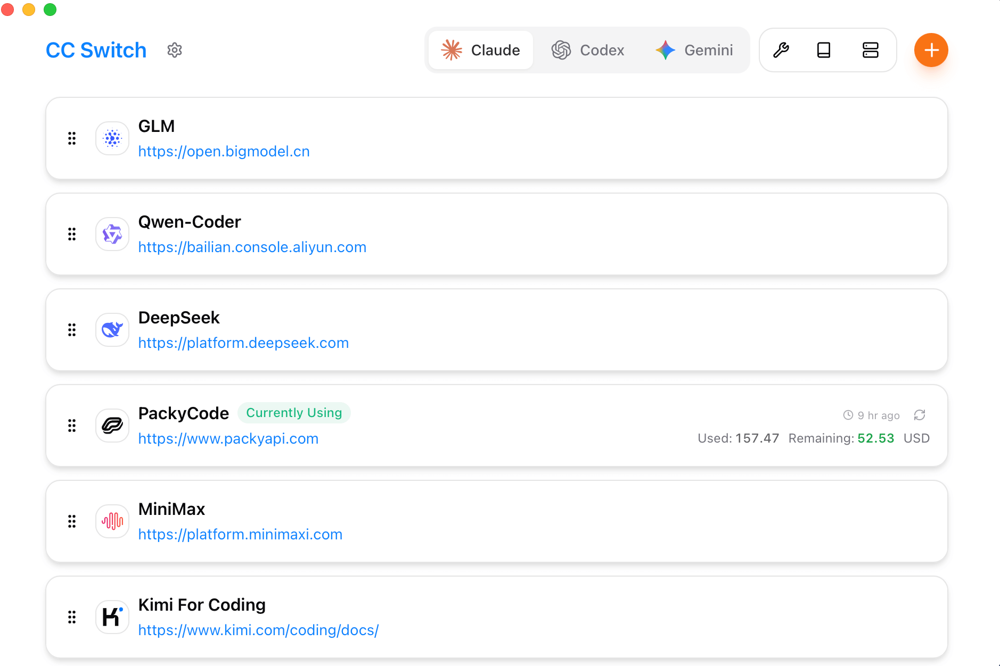
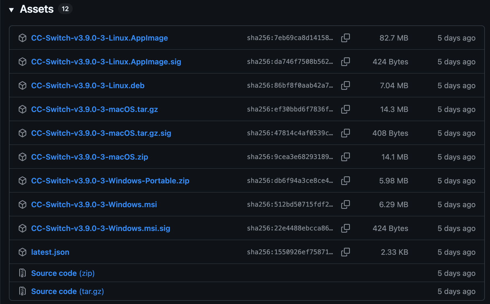

## 一、Claude Code简介

#### 1.什么是Claude Code

Claude Code 是 Anthropic 推出的面向开发者的 AI 编程协作工具，与在聊天窗口里写几段代码不同，Claude Code 的核心目标是理解你的整个项目，并参与到真实的编码、修改和重构过程中。

Claude Code 不是一个代码生成器，而是一个能读项目、懂上下文、遵守约束的 AI 编程搭档。

简单说:**Claude Code 是 Claude 的命令行版本,专门为编程场景设计**。

它不是网页里的聊天框，而是直接在你的终端(Terminal)里运行,可以:

- 读取你整个项目的代码
- 理解文件之间的关系
- 直接修改代码文件
- 执行你的指令并给出建议

**Claude Code 是 Agent（智能体工具），不是 Chat（聊天工具）。**

#### 2.Claude Code vs. 网页版 Claude

| 特性       | Claude 网页版 / App  | Claude Code (CLI)                   |
| :--------- | :------------------- | :---------------------------------- |
| 交互方式   | 复制粘贴代码到对话框 | 直接在终端通过指令操作              |
| 文件访问   | 手动上传文件         | 自动读取/搜索整个工程目录           |
| 执行能力   | 仅生成文本           | 执行 Shell 命令、运行测试、创建文件 |
| 上下文感知 | 有限的对话上下文     | 深度感知项目结构和 Git 历史         |

- **Claude(网页版)** 就像一个顾问，你把代码截图或复制给他，他给你建议，但你得自己动手改。
- **Claude Code** 就像一个坐在你旁边的搭档，他能看到你的整个项目，帮你改代码，甚至帮你写测试、重构函数。

#### 3.相关资源

- 官方文档：https://code.claude.com/docs/en/overview
- 中文文档：https://code.claude.com/docs/zh-CN/overview
- Github 开源：https://github.com/anthropics/claude-code

## 二、Claude Code 安装与使用

#### 1.使用方式

Claude Code的三种使用方式对比如下：

| 方式                              | 适合人群           | 优点              | 缺点               |
| :-------------------------------- | :----------------- | :---------------- | :----------------- |
| Web 端                            | 完全新手           | 无需安装,打开就用 | 功能相对有限       |
| CLI(命令行)                       | 有一定基础的开发者 | 功能完整,集成度高 | 需要熟悉命令行     |
| 编辑器集成（VS Code / Cursor 等） | 日常开发           | 无缝融入工作流    | 依赖插件和环境配置 |

目前 Claude Code 的桌面版也发布了，下载地址：https://claude.com/download。

#### 2.安装方式

##### (1)账号注册

访问 [claude.ai](https://claude.ai/) 注册账号，可以使用谷歌账号进行注册

- 如果不方便进行账号注册，也可以将cli中的模型切换为国产模型（DeepSeek/Minimax/GLM），后文会介绍怎么切换。

##### (2)使用官方脚本安装

- macOS, Linux, WSL:

~~~bash
curl -fsSL https://claude.ai/install.sh | bash
~~~

- Windows PowerShell:

~~~bash
irm https://claude.ai/install.ps1 | iex
~~~

- Windows CMD:

~~~bash
curl -fsSL https://claude.ai/install.cmd -o install.cmd && install.cmd && del install.cmd
~~~

安装完成以后，在终端输入以下命令进行验证：

~~~bash
claude -version
~~~



如果显示版本号，说明安装成功!

##### (3)使用 npm 安装

- 你的电脑需要安装了 Node.js，在命令行输入：

~~~bash
node -version
~~~

如果显示版本号(比如 `v18.17.0`)，说明已安装。如果没有，去 [nodejs.org](https://nodejs.org/) 下载安装。首次安装，推荐先安装NVM进行node版本管理

- 打开命令行，输入以下命令:

~~~bash
npm install -g @anthropic-ai/claude-code
~~~

安装完成以后，在终端输入`claude -version`进行验证：

**常见安装问题与解决**：

**问题 1**:提示 `npm command not found`

- 原因:你的电脑没有安装 Node.js

- 解决:去 [nodejs.org](https://nodejs.org/) 下载安装,然后重新执行安装命令

**问题 2**:提示 `permission denied`

- 原因:没有管理员权限

- 解决(Mac/Linux):在命令前加 `sudo`

```
sudo npm install -g @anthropic-ai/claude-code
```

- 解决(Windows):以管理员身份运行 PowerShell

**问题 3**:安装很慢或者卡住

- 原因:网络问题

- 解决:使用国内镜像源

```
npm install -g @anthropic-ai/claude-code --registry=https://registry.npmmirror.com
```

#### 3.登录Claude Code

打开 终端 或者 IDE，运行：

~~~bash
claude
~~~

启动后，系统会提示你登录，在 Claude Code 界面中输入:

~~~bash
/login
~~~

如果遇到下面的提示，选择第一个 yes ，然后按回车即可，这是在提示你授权 Claude Code 访问并执行当前文件夹里的代码，用于读取、修改和运行项目文件



接下来在对话框里面可以输入：您好！如果正常回复，则说明配置成功



##### 无法连接到 Anthropic 服务



在 ~/.claude.json 文件中（windows中为`C:\Users\~(用户名)`），添加一行：`"hasCompletedOnboarding": true,`



#### 4.VS Code 中使用 Claude Code

如果不喜欢使用 Claude Code 的命令行模型，我们可以在 VS Code 编辑器中安装 Claude Code。

打开 VS Code，进入扩展市场，搜索 **Claude Code** 安装：



安装完成后，点击右上角 Claude Code 图标，即可进入 Claude Code 页面：



## 三、Claude Code API 配置

Claude 在国内用，API 其实不是很友好，除了 Claude 官方的模型，还可以通过配置修改为国产模型：

| 厂商/品牌                | 简介                                               | API 申请入口（点击即达）                                     |
| :----------------------- | :------------------------------------------------- | :----------------------------------------------------------- |
| DeepSeek（国产高性价比） | 官方模型：deepseek-chat / deepseek-reasoner        | https://platform.deepseek.com/api_keys                       |
| 阿里百炼（通义千问）     | 阿里云大模型统一入口，支持 qwen-max、qwen-turbo 等 | [https://bailian.console.aliyun.com](https://bailian.console.aliyun.com/?userCode=i5mn5r7m) |
| GLM（智谱清言）          | 清华系 ChatGLM 系列，支持 GLM-4、GLM-3-Turbo 等    | [https://open.bigmodel.cn](https://www.bigmodel.cn/glm-coding?ic=EMWK7IPUCE) |
| MiniMax                  | 国产多模态，支持文本、语音、图像混合调用           | [https://platform.minimaxi.com](https://platform.minimaxi.com/) |

#### 1.API 管理工具

平台一多，配置起来就麻烦，我们可以使用第三方工具 CC Switch 可以帮我们轻松管理这几个热门工具的 API 配置：https://github.com/farion1231/cc-switch/，Windows / macOS / Linux 全支持。

CC Switch 是一个 Claude Code / Codex / Gemini CLI 的全方位辅助工具。

CC Switch 可以帮我们轻松管理这几个热门工具的 API 配置，就好比给你的开发工具箱来了个智能整理助手，所有工具的配置都能在它这有序管理。



各平台安装包下载地址：https://github.com/farion1231/cc-switch/releases。



具体的操作设置参考文章：https://mp.weixin.qq.com/s/pa9Gpim7jVXsUtEM8JwnSg

#### 2.配置环境变量

通过配置文件 `~/.claude/settings.json`进行claude环境变量的配置

- **~** 代表用户主目录，如果 **.claude** 目录不存在，需要先行创建，可在终端执行 **mkdir -p ~/.claude** 来创建。

##### (1)**macOS/Linux：**

编辑配置文件：

~~~bash
vim ~/.claude/settings.json
~~~

以阿里百炼为例，将 YOUR_API_KEY 替换为 Coding Plan 套餐专属 API Key

~~~json
{
    "env": {
        "ANTHROPIC_AUTH_TOKEN": "YOUR_API_KEY",
        "ANTHROPIC_BASE_URL": "https://coding.dashscope.aliyuncs.com/apps/anthropic",
        "ANTHROPIC_MODEL": "qwen3-coder-plus"
    }
}
~~~

重新打开一个新的终端使环境变量配置生效。

##### (2)**Windows：**

- 在 CMD 中运行以下命令，设置环境变量：

```bash
setx ANTHROPIC_AUTH_TOKEN "YOUR_API_KEY"
setx ANTHROPIC_BASE_URL "https://coding.dashscope.aliyuncs.com/apps/anthropic"
setx ANTHROPIC_MODEL "qwen3-coder-plus"
```

- 或在 PowerShell 中运行以下命令，设置环境变量：

```bash
# 用套餐专属 API Key 替换 YOUR_API_KEY
[Environment]::SetEnvironmentVariable("ANTHROPIC_AUTH_TOKEN", "YOUR_API_KEY", [EnvironmentVariableTarget]::User)
[Environment]::SetEnvironmentVariable("ANTHROPIC_BASE_URL", "https://coding.dashscope.aliyuncs.com/apps/anthropic", [EnvironmentVariableTarget]::User)
[Environment]::SetEnvironmentVariable("ANTHROPIC_MODEL", "qwen3-coder-plus", [EnvironmentVariableTarget]::User)
```

- 或打开 ~/.claude/settings.json 文件来配置大模型

打开一个新的 CMD 窗口，运行以下命令，检查环境变量是否生效。

```bash
echo %ANTHROPIC_AUTH_TOKEN%
echo %ANTHROPIC_BASE_URL%
echo %ANTHROPIC_MODEL%
```

##### (3)不同模型的配置

以`~/.claude/settings.json`文件配置为例，列出各模型的配置

###### **DeepSeek**

~~~json
{
    "env": {
        "ANTHROPIC_AUTH_TOKEN": "YOUR_API_KEY",
        "ANTHROPIC_BASE_URL": "https://api.deepseek.com/anthropic",
        "ANTHROPIC_MODEL": "deepseek-chat",
        "API_TIMEOUT_MS":600000,
        "ANTHROPIC_SMALL_FAST_MODEL":"deepseek-chat",
        "CLAUDE_CODE_DISABLE_NONESSENTIAL_TRAFFIC":1
    }
}
~~~

**参数说明：**

- `API_TIMEOUT_MS=600000`：设置 10 分钟超时，防止输出过长触发客户端超时
- `ANTHROPIC_MODEL`：指定使用 deepseek-chat 模型
- `CLAUDE_CODE_DISABLE_NONESSENTIAL_TRAFFIC=1`：禁用非必要流量

###### **阿里百炼**

~~~json
{
    "env": {
        "ANTHROPIC_AUTH_TOKEN": "YOUR_API_KEY",
        "ANTHROPIC_BASE_URL": "https://coding.dashscope.aliyuncs.com/apps/anthropic",
        "ANTHROPIC_MODEL": "qwen3-coder-plus"
    }
}
~~~

###### **通义千问**

~~~json
{
  "env": {
    "ANTHROPIC_MODEL": "qwen3-coder-plus",
    "ANTHROPIC_SMALL_FAST_MODEL": "qwen-flash"
  }
}
~~~

###### 智谱大模型

~~~json
# 注意替换里面的your_zhipu_api_key 为您上一步获取到的 API Key
{
    "env": {
        "ANTHROPIC_AUTH_TOKEN": "your_zhipu_api_key",
        "ANTHROPIC_BASE_URL": "https://open.bigmodel.cn/api/anthropic",
        "API_TIMEOUT_MS": "3000000",
        "CLAUDE_CODE_DISABLE_NONESSENTIAL_TRAFFIC": 1
    }
}
~~~

